#### Author: Nnanna Samuel Ifeanyi
#### Role: DevOps Engineer

## Table of Contents

- [Project Architecture](#project-architecture)
- [Project Overview](#project-overview)
- [Infrastructure Setup](#infrastructure-setup)
- [Repository Structure](#repository-structure)
- [Screenshots](#screenshots)

---
### Project Architecture
[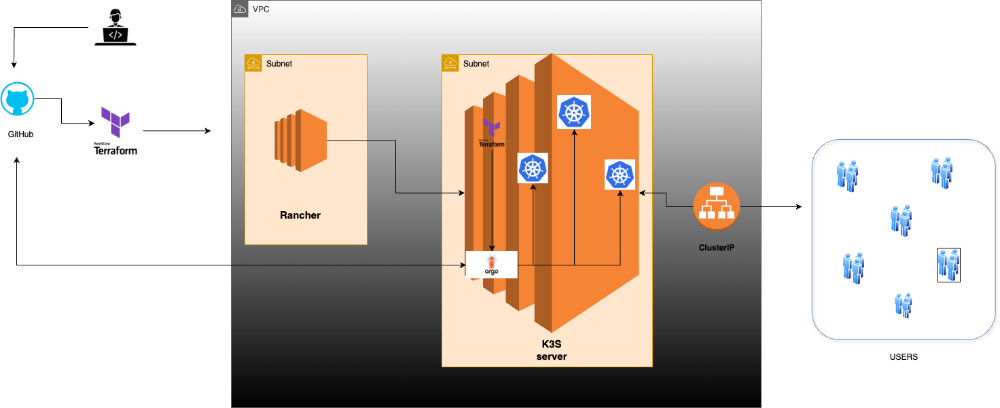](Architecture.png)


## Project Overview

This project demonstrates the deployment of a lightweight Kubernetes cluster using Rancher and k3s. Additionally, ArgoCD is installed using Terraform to manage and automate the deployment of applications via Helm charts.

---

## Infrastructure Setup

1. **Virtual Machines:**

   - For lack of compute power locally, two virtual machines (VM) were created on AWS using Terraform. 
   - One VM is dedicated to Rancher, and the other is used to deploy a k3s cluster.
   
   ### How to Use

   - Clone the Repository and get into the infrastructure directory
   ```sh
   git clone https://github.com/IfeanyiSam/JEC-Task.git temp
   cd temp/infrastructure/cloud_resource
   ```
   
   - The Terraform scripts written in a modular structure provisions two EC2 instances on AWS, one is the Rancher VM and the other is the K3s VM.
   - The [modules](infrastructure/cloud_resource/modules) folder comprises of three folders, compute, security and vpc.
   - The scripts in the compute folder handles the EC2 instance provisioning
   - The scripts in the security folder handles the network access (allowed ports) on the EC2 instances.
   - The scripts in the vpc folder handles the provisioning of the private environment where the servers (EC2        instances) will be provisioned including their subnets and security groups.
   - **To use this**, run
   ```sh
   cd temp/infrastructure/cloud_resource
   terraform init
   terraform plan
   terraform apply
   ```
   **To clean up;**
   ```sh
   terraform destroy
   ```
**NB** *If you already have a running VM or have great local computer power, you can skip the Infrastructure Setup*

2. **Rancher Installation:**

   - Installed Rancher on the first VM following the [official documentation](https://rancher.com/docs/rancher/v2.6/en/installation/) and leveraging the script "rancher.sh"
   - Rancher provides a UI for managing Kubernetes clusters.
   - Rancher is installed into the Rancher VM using the docker technology and for the project, terraform handles the installation by leveraging a bash script [rancher.sh](infrastructure/cloud_resource/scripts/rancher.sh)
. This script installs Docker in the Rancher VM and then runs the Rancher installation command.
```sh
⁠ chmod +x infrastructure/cloud_resource/scripts/rancher.sh ⁠ ⁠
```

3. **k3s Cluster Deployment:**

   - After Rancher is installed, the UI is accessed through the public IP address of the EC2 instance.
   
   - The first landing page would be a request to input the bootstrap password which gives the user access to Rancher for cluster provisioning and management. This is command looks like this;
    ```sh
    docker logs container-id 2>&1 | "Bootstrap Password:"
    ```
    where container-id is a placeholder for the Rancher Container ID running in the Rancher VM and can be seen by running;
    ```sh
    docker ps
    ```
   
   - This is seen [here](JEC/RancherVM_running_container.png) and [here](JEC/RancherUI_bootstapp_pass.png).
   
   - After the Bootstrap password is retrieved, head back to the Rancher UI and input to gain access to the Cluster Management Interface.
   
   - The first step would be to click on create, then select "custom" so we can use the already provisioned k3s VM.
   
   - Select Preferred configurations for the k3s cluster then click on "create". A command will be displayed and this command is to be executed in the k3s VM to provision the cluster using the selected configurations.
   
   - NB If you do not have an ssl cert on the k3s vm for HTTPS connection, ensure you check the "insecure" box to skip TLS verification.
   These can be seen [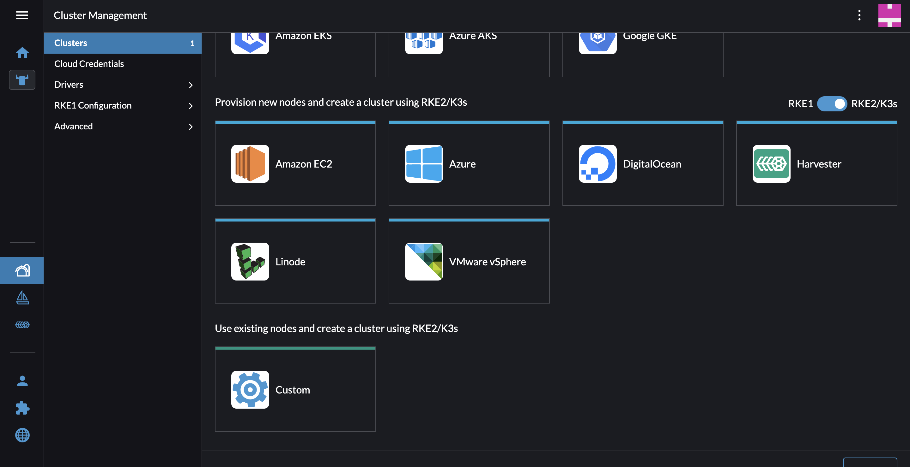](JEC/RancherUI_k3s_config.png)
[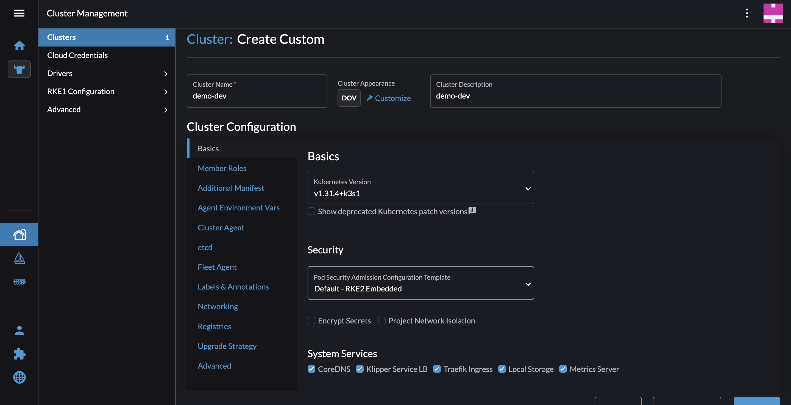](JEC/RancherUI_k3s_config2.png)
[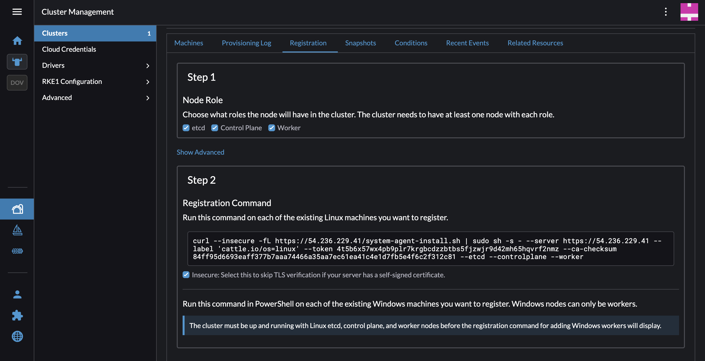](JEC/RancherUI_k3s_init_com.png)
 

4. **Terraform for ArgoCD Installation:**

   - ArgoCD is installed on the k3s cluster using Terraform.
  
   - The Terraform configuration is written in a modular structure as seen [here](infrastructure/argocd-terraform/)
  
   - The [main](infrastructure/argocd-terraform/main/) directory contains the main.tf, providers.tf and variables.tf while the [modules](infrastructure/argocd-terraform/modules/) contain the argocd deployment files which would be used to install ArgoCD inside the k3s cluster in a namespace called argocd. All of this is done by leveraging terraform. Terraform was already installed in the k3s VM using the [script](infrastructure/cloud_resource/scripts/k3s.sh)
  
   - To simplify and automate ArgoCD installation and Deploy the applications in [demo-dev](demo-dev), the bash scripts [K3s_config_setup](k3s_init.sh) and [Logging](logging.sh) are used.
  
   - The former, sets up the kubeconfig path and attaches the necessary permissions, installs argocd and deploys the application while the latter is used for logging. Both could be used as one script but for reusability purposes, they are separated.
  
   - To implement the above, scp is used to transfer the mentioned files into the K3s VM. The [script](transfer_scripts.sh) can help with this step by making it executable using; 
   ```sh
   chmod +x transfer_scripts.sh
   ```
   and then executing the script using;
   ```sh
   ./transfer_scripts.sh
   ```
  
   - When the scripts have been moved to the K3s VM, you can execute it by running the command;
   ```sh
   ./k3s_init.sh
   ```
   These can be seen below;
   [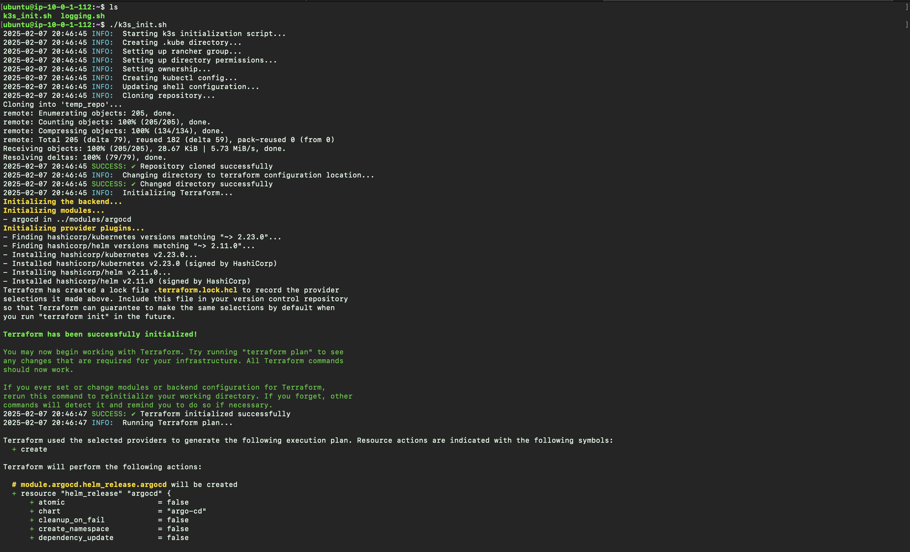](JEC/K3sVM_ArgoCD_installation.png)
[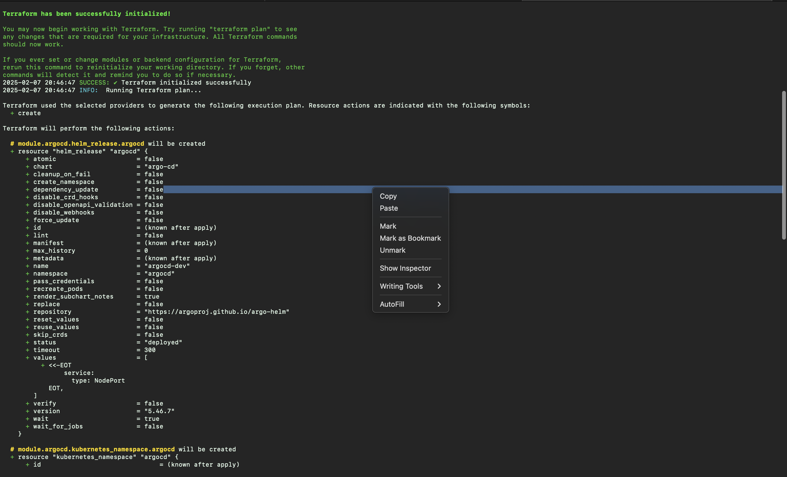](JEC/K3sVM_ArgoCD_Installation2.png)
[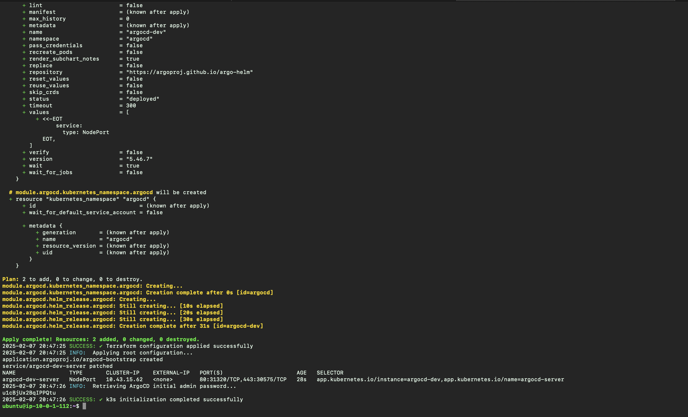](JEC/K3sVM_ArgoCD_installation_complete.png)


5. **Application Deployment with ArgoCD:**

   - A dummy application is deployed using Helm charts via ArgoCD. This is also handled by the K3s_init.sh.
   
   - The entry point for ArgoCD is the root.yaml file which enables Argocd to track changes in the git repository and maintains the state of the applications in the repository. This is a typical example of a GitOps Practice where git is used as a single source of truth.
   
   - Now access the ArgoCD UI via the K3s VM public IP address and the nodeport  displayed on the terminal which can be seen in the k3s_script.sh logs [here](JEC/K3sVM_ArgoCD_installation_complete.png)
   Login credentials will be required to see the ArgoCD dashboard. The default username is admin while the password is in an encoded file created during the ArgoCD deployment. The password can be retrieved using;
   ```sh
   sudo kubectl -n argocd get secret argocd-initial-admin-secret -o jsonpath="{.data.password}" | base64 -d
   ``` 
   But this has already been handled by the k3s_init.sh and the password can be seen in the logs as well [here](JEC/K3sVM_ArgoCD_installation_complete.png). Cool right!. Yes, a lot of people underestimate the power of bash scripting. 

   - Here on the dashboard, you can see the applications which have been deployed through the application of the root.yaml file which ArgoCD uses to track the Git repository and maintain the state of the repository.

   - By State management, I mean if an Application is deleted mistakenly, ArgoCD polls the repo to ensure that the applications are always deployed.

   - All the expected results for the ArgoCD installation can be seen below;

- ⁠First time UI access
[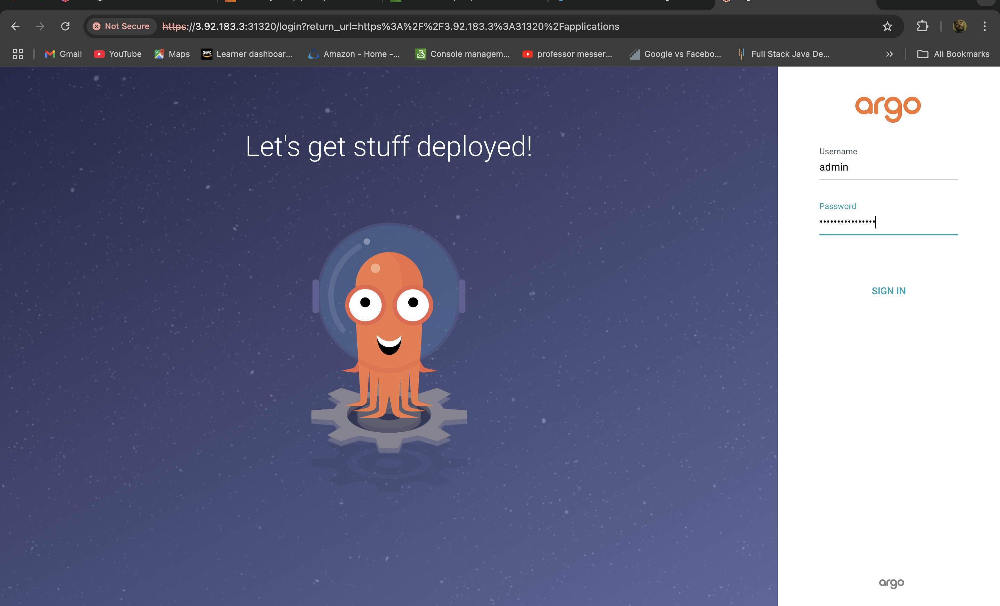](JEC/ArgoCD_UI_Login.png)

-  ⁠⁠All applications already running
[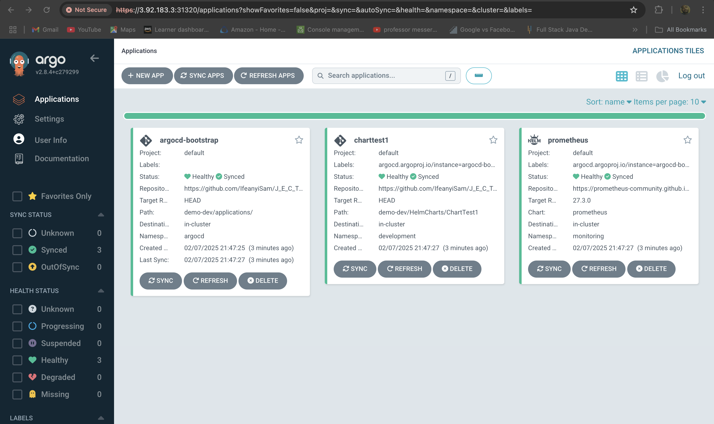](JEC/ArgoCD_UI_Applications_Dashboard.png)

- Delete prometheus application (testing ArgoCD’s state management power)
[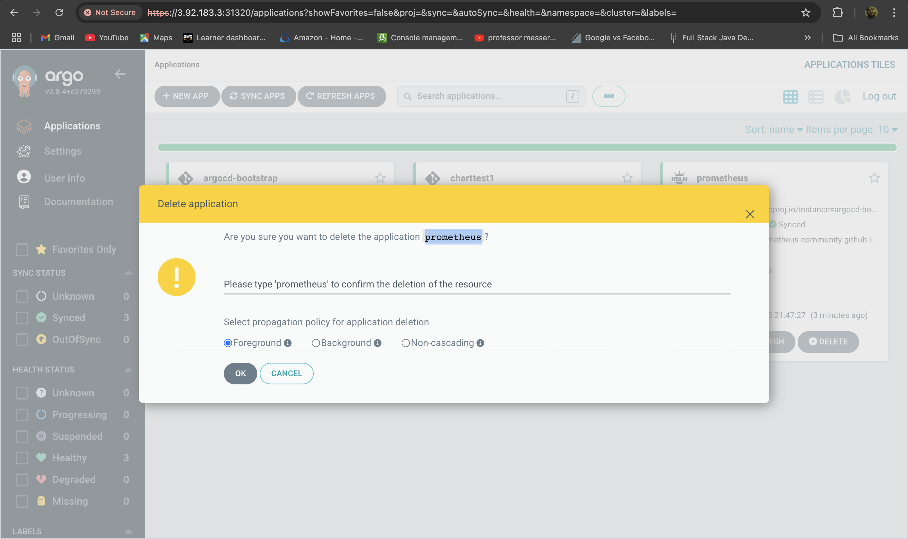](JEC/ArgoCD_UI_State_management_test.png)

- ArgoCD detects and recreates the prometheus application
[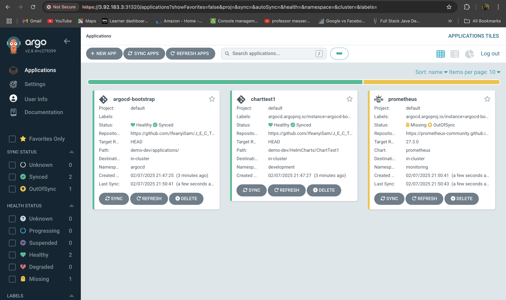](JEC/ArgoCD_UI_State_management_test2.png)
---

---

## Repository Structure

```
.
├── HelmCharts
│   └── ChartTest1
│       ├── Chart.yaml
│       ├── templates
│       │   ├── deployment.yaml
│       │   └── service.yaml
│       ├── values.yaml
│       └── values_dev.yaml
├── applications
│   ├── app1.yaml
│   └── app2.yaml
└── root.yaml
```

## Screenshots

The `JEC` folder contains screenshots verifying successful deployments.
---

## Conclusion

This project demonstrates infrastructure automation and GitOps practices using Terraform, ArgoCD, and Helm charts to deploy applications on a Kubernetes cluster managed by Rancher.

### **Always remember to clean up since cloud resources are being used!**
---
For further queries, feel free to reach out!

**Happy DevOpsing!** 
